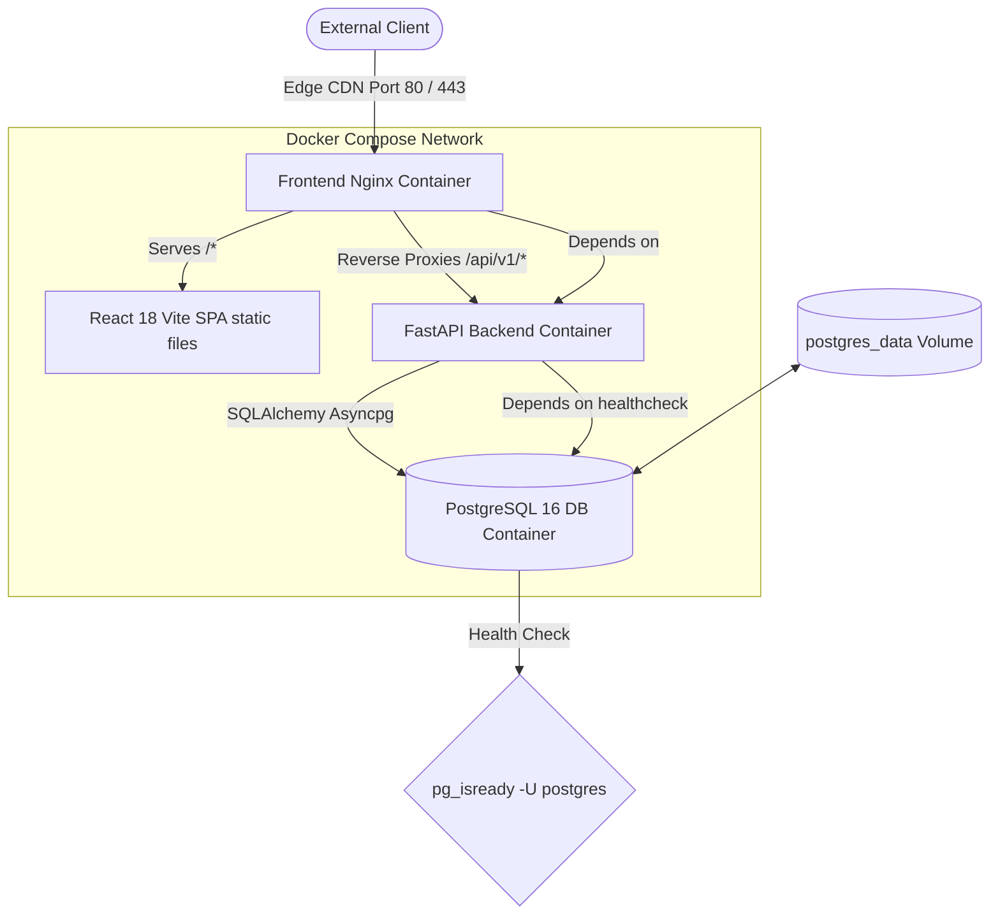

# 📦 High-Performance Inventory & Order Management System

[](https://fastapi.tiangolo.com/)
[](https://react.dev/)
[](https://www.docker.com/)
[](https://www.postgresql.org/)
[](https://mui.com/)

A production-ready, security-hardened **Inventory & Order Management System** featuring a high-performance **FastAPI** backend, robust **PostgreSQL** relational schemas mapped with **SQLAlchemy 2.0**, and an ultra-premium **Material UI** administrator control dashboard.

---

## 📷 Screenshots

| Executive Metrics Dashboard | Products Catalog Management |
| :---: | :---: |
|  |  |

| Customers Profiles Database | Dynamic Order Checkout Modal |
| :---: | :---: |
|  |  |

---

## ✨ Features

* **🖥️ Premium MUI Dark-Themed SPA**: Built with **React 18** and **Material UI (MUI v5)**. Configured with HSL dark theme templates and custom grids showing Total Products, Customers, Orders, and Low Stock Warnings.
* **🔒 Concurrency-Safe Checkout**: Implements **Pessimistic Concurrency write-locks (`SELECT ... FOR UPDATE`)** on catalog products during checkout to block race conditions and prevent over-selling in highly concurrent environments.
* **⚡ Atomic Database Transactions**: Enforces absolute data boundaries—automatically checking inventory, reducing stock levels, calculating totals, and logging line items, calling clean session `rollback` if any intermediate item check fails.
* **🔄 Order Cancellation Return**: Supports canceling pending/processing orders, dynamically releasing row locks and returning line-item quantities back to catalog stock levels (rejects cancellations if order has already shipped).
* **🧹 React Hook Form Validation**: Integrates **React Hook Form (RHF v7)** to handle fast validation loops, blocking spaces in SKU entries, enforcing positive price limits (`price > 0`), and checking non-negative stock volumes (`stock_quantity >= 0`).
* **📁 Database RESTRICT Delete Rules**: Removed database cascades on Product `order_items` relationships, enforcing **`RESTRICT` foreign key rules** to prevent deleting products that have historical purchase records, preserving vital financial audit trails.

---

## 🏗️ System Architecture

The application is fully containerized and decoupled using Docker, serving static files and reverse proxying API traffic cleanly:



---

## 🔌 API Endpoints Mapping

All API endpoints follow RESTful standards under the `/api/v1` prefix:

### Products Catalog (`/api/v1/products`)
* `POST /products/` (201 Created) - Register a new product catalog item (enforces unique SKUs).
* `GET /products/` (200 OK) - Paginated listing of catalog products.
* `GET /products/{id}` (200 OK) - Retrieve detailed attributes of a single product.
* `PUT /products/{id}` (200 OK) - Modify details on a product (verifies SKU uniqueness).
* `DELETE /products/{id}` (204 No Content) - Remove a product (blocked by RESTRICT if ordered historically).

### Customers (`/api/v1/customers`)
* `POST /customers/` (201 Created) - Register a new customer profile (enforces unique email strings).
* `GET /customers/` (200 OK) - Paginated listing of registered customers.
* `GET /customers/{id}` (200 OK) - Retrieve customer details by UUID.
* `DELETE /customers/{id}` (204 No Content) - Delete a customer account (deletes associated orders under cascade).

### Orders Checkout (`/api/v1/orders`)
* `POST /orders/` (201 Created) - Place a new customer checkout order (atomic transaction).
* `GET /orders/` (200 OK) - Paginated list of placed orders.
* `GET /orders/{id}` (200 OK) - Retrieve specific order parameters and itemized invoice receipt.
* `POST /orders/{id}/cancel` (200 OK) - Cancel an active order and restore purchased stock.

---

## 🐳 Containerized Setup (Recommended)

### Prerequisites
* [Docker Desktop](https://www.docker.com/products/docker-desktop/)
* [Docker Compose V2](https://docs.docker.com/compose/)

### Step 1: Clone and Configure Environment
Copy the environment variables template and customize details:
```bash
cp .env.example .env
```

### Step 2: Boot Services Detached
Compile and run the multi-container environment:
```bash
docker compose up --build -d
```
Docker Compose will automatically:
1. Build the multi-stage, security-hardened **Python 3.12** backend container image.
2. Build the **Node 20 / Nginx** static React SPA builder container.
3. Provision the **PostgreSQL 16** container database, persistence volume `postgres_data`, and health checks.

### Step 3: Access Control Panels
* **React Dashboard UI**: [http://localhost:80/](http://localhost:80/)
* **Interactive Swagger UI Docs**: [http://localhost:80/docs](http://localhost:80/docs)
* **Static ReDoc Documentation**: [http://localhost:80/redoc](http://localhost:80/redoc)

---

## 💻 Local Development Setup

### 1. Backend (FastAPI)
Ensure you have Python 3.12+ and PostgreSQL installed on your system.

```bash
cd backend
python -m venv venv
source venv/bin/activate  # On Windows: .\venv\Scripts\activate
pip install -r requirements.txt
uvicorn app.main:app --host 0.0.0.0 --port 8000 --reload
```
*Note: We integrated FastAPI `CORSMiddleware` in `main.py` to support smooth cross-origin connections during local testing.*

### 2. Frontend (React + Vite)
Ensure you have Node.js 20+ installed.

```bash
cd frontend
npm install
npm run dev
```
*Note: We pre-configured a Vite dev-server **proxy block** inside `vite.config.js` forwarding all `/api/v1/*` requests directly to port `8000` automatically, eliminating CORS blocks locally.*

---

## 🚀 Production Cloud Deployment URLs

The system is fully decoupled and optimized for cloud staging deployments:

### Backend & DB: [Railway](https://railway.app/)
* Builds automatically via `backend/Dockerfile` using Python 3.12.
* Provisioned PostgreSQL 16 database.
* **Production API Base**: `https://YOUR_BACKEND_RAILWAY_URL.up.railway.app`

### Frontend: [Vercel](https://vercel.com/)
* Builds Vite statically using Node 20.
* Serves files globally via Vercel Edge CDNs.
* Includes [vercel.json](file:///C:/Users/faisa/.gemini/antigravity/scratch/inventory-order-mgmt/frontend/vercel.json) rewrites, routing `/api/v1/*` Edge requests directly to Railway to prevent production CORS, and setting up SPA fallbacks.
* **Production Live Dashboard**: `https://YOUR_FRONTEND_VERCEL_URL.vercel.app`
